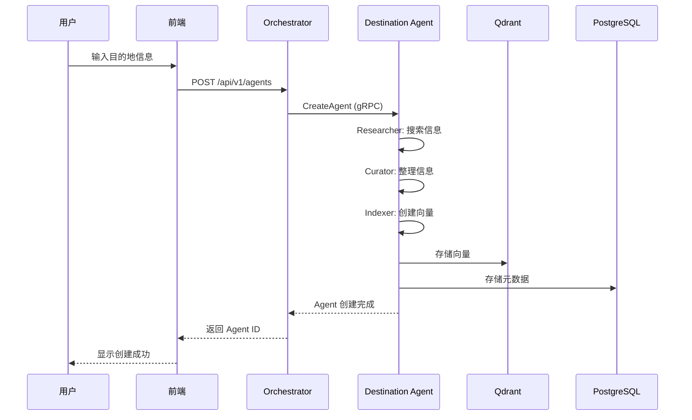

# Agent 创建流程

## 概述

本文描述用户创建目的地 Agent 的完整流程。

## 流程图



## 详细步骤

### 1. 用户输入
用户在前端输入:
- 目的地名称 (例如: "京都, 日本")
- 主题 (文化/美食/探险/艺术)
- 语言偏好

### 2. API 请求
前端发送 REST API 请求到 Orchestrator:
```json
{
  "destination": "京都, 日本",
  "theme": "cultural",
  "languages": ["zh", "en"]
}
```

### 3. 任务分配
Orchestrator:
1. 创建任务
2. 分配给 Destination Agent
3. 返回任务 ID 给前端

### 4. Agent 处理
Destination Agent 执行:

#### 4.1 Researcher Sub-Agent
- 搜索目的地相关信息
- 爬取旅游网站内容
- 提取文本和图片

#### 4.2 Curator Sub-Agent
- 清洗和结构化数据
- 提取关键信息
- 创建知识图谱

#### 4.3 Indexer Sub-Agent
- 文本分块 (Chunking)
- 创建向量嵌入 (Embedding)
- 存储到 Qdrant

### 5. 持久化
- 元数据存储到 PostgreSQL
- 向量数据存储到 Qdrant
- 原始文档存储到 MinIO

### 6. 完成
Agent 状态更新为 "ready"，用户可以开始使用。

## 错误处理

| 错误 | 处理方式 |
|-----|---------|
| 网络超时 | 重试 3 次，然后标记失败 |
| 数据源不可用 | 使用备选数据源 |
| 向量存储失败 | 回滚并重试 |

## 性能优化

- 并行执行 Researcher 和 Curator
- 使用增量索引
- 缓存常用查询