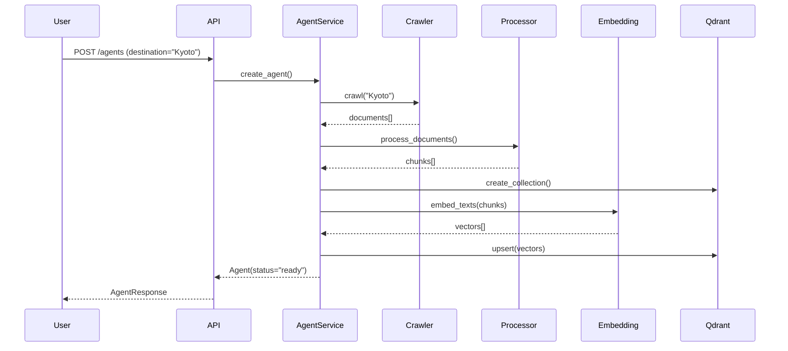
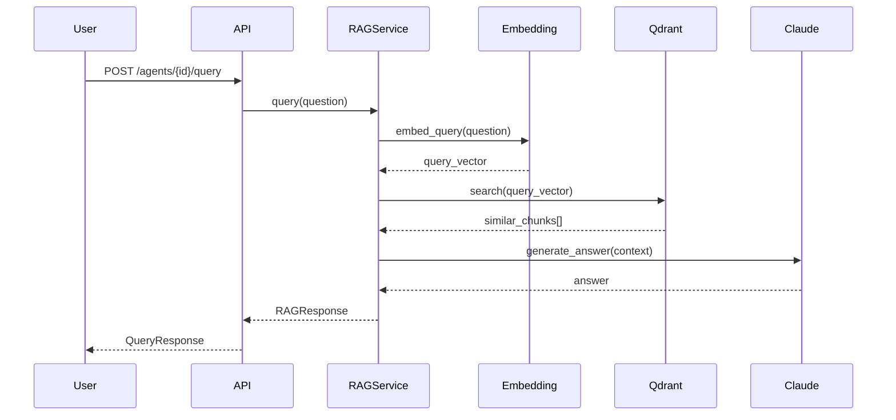

# RAG Pipeline Implementation

## Overview

本文详细描述 UTA Travel Agent 的 RAG (Retrieval-Augmented Generation) 实现细节。

## Architecture

```
┌─────────────────────────────────────────────────────────────────────────┐
│                         RAG Pipeline                                    │
│                                                                         │
│  ┌─────────────┐    ┌─────────────┐    ┌─────────────┐                 │
│  │   Crawler   │───▶│  Document   │───▶│   Chunker   │                 │
│  │             │    │  Processor  │    │             │                 │
│  └─────────────┘    └─────────────┘    └─────────────┘                 │
│         │                                     │                         │
│         ▼                                     ▼                         │
│  ┌─────────────┐    ┌─────────────┐    ┌─────────────┐                 │
│  │  Documents  │    │  Embedding  │───▶│   Qdrant    │                 │
│  │   Storage   │    │   Service   │    │   Vector    │                 │
│  └─────────────┘    └─────────────┘    └─────────────┘                 │
│                                                 │                       │
│                                                 ▼                       │
│  ┌─────────────┐    ┌─────────────┐    ┌─────────────┐                │
│  │   Query     │───▶│   Vector    │───▶│    RAG      │                │
│  │             │    │   Search    │    │   Service   │                │
│  └─────────────┘    └─────────────┘    └─────────────┘                │
│                                                 │                       │
│                                                 ▼                       │
│                                        ┌─────────────┐                │
│                                        │   Claude    │                │
│                                        │     API     │                │
│                                        └─────────────┘                │
└─────────────────────────────────────────────────────────────────────────┘
```

## Components

### 1. Document Processor (`document_processor.py`)

Responsible for cleaning and chunking documents.

```python
class DocumentProcessor:
    def __init__(self, config: ChunkingConfig)
    def process_document(self, document: Document) -> list[Chunk]
    def _clean_text(self, text: str) -> str
    def _split_into_sections(self, text: str) -> list[str]
    def _chunk_section(self, section: str) -> list[Chunk]
```

**Chunking Strategy**:
- Target chunk size: 512 tokens
- Overlap: 50 tokens
- Respects document structure (headers, paragraphs)
- Uses tiktoken for accurate token counting

**Text Cleaning**:
- Remove excessive whitespace
- Normalize quotes and dashes
- Remove web artifacts (cookie banners, etc.)

### 2. Embedding Service (`embeddings.py`)

Creates vector embeddings using sentence-transformers.

```python
class EmbeddingService:
    def __init__(self, model: str = "multilingual")
    async def embed_text(self, text: str) -> list[float]
    async def embed_texts(self, texts: list[str]) -> list[list[float]]
    async def embed_query(self, query: str) -> list[float]
```

**Model Options**:
| Preset | Model | Dimension | Languages |
|--------|-------|-----------|-----------|
| multilingual | paraphrase-multilingual-MiniLM-L12-v2 | 384 | 50+ |
| english | all-MiniLM-L6-v2 | 384 | English |
| quality | all-mpnet-base-v2 | 768 | English |
| asian | distiluse-base-multilingual-cased-v1 | 768 | Asian focus |

**Features**:
- LRU caching for repeated queries
- Batch processing for efficiency
- Async execution to avoid blocking

### 3. Vector Store (`vector_store.py`)

Manages Qdrant collections and vector operations.

```python
class QdrantVectorStore:
    async def create_collection(self, name: str, vector_size: int)
    async def index_chunks(self, collection: str, chunks: list[Chunk])
    async def search(self, collection: str, query: str, limit: int)
    async def delete_collection(self, name: str)
```

**Collection Schema**:
```json
{
  "vectors": {
    "size": 384,
    "distance": "Cosine"
  },
  "payload_schema": {
    "document_id": "keyword",
    "content": "text",
    "chunk_index": "integer",
    "document_title": "keyword"
  }
}
```

### 4. RAG Service (`rag_service.py`)

Combines retrieval with LLM generation.

```python
class RAGService:
    async def query(self, context: SearchContext) -> RAGResponse
    async def search_only(self, context: SearchContext) -> list[dict]
    async def stream_answer(self, context: SearchContext)
```

**Query Flow**:
1. Embed query using EmbeddingService
2. Search Qdrant for top-k similar chunks
3. Build context from retrieved chunks
4. Send to Claude API with system prompt
5. Return answer with sources

## Data Flow

### Agent Creation Flow



### Query Flow



## Configuration

### Environment Variables

```bash
# Qdrant
QDRANT_HOST=localhost
QDRANT_PORT=6333

# Claude API
ANTHROPIC_API_KEY=sk-ant-...

# Embedding
EMBEDDING_MODEL=multilingual
```

### Chunking Config

```python
ChunkingConfig(
    chunk_size=512,      # Target tokens per chunk
    chunk_overlap=50,    # Overlap between chunks
    min_chunk_size=100,  # Minimum valid chunk
    max_chunk_size=1024, # Maximum chunk size
)
```

## Performance Optimization

### Batch Processing
- Documents are processed in parallel
- Embeddings created in batches (default: 32)
- Qdrant upserts batched (default: 100)

### Caching
- Embedding cache: 10,000 entries default
- Qdrant connection pooling
- HTTP client reuse for crawling

### Async Architecture
- All I/O operations are async
- Non-blocking embedding with thread pool
- Concurrent web crawling with semaphore

## Error Handling

| Error | Handling |
|-------|----------|
| Crawl failure | Skip URL, continue with others |
| Embedding failure | Retry with exponential backoff |
| Qdrant unavailable | Return graceful error message |
| Claude API error | Return context-only response |

## Testing

### Unit Tests
```bash
pytest tests/test_document_processor.py -v
pytest tests/test_embeddings.py -v
pytest tests/test_rag_service.py -v
```

### Integration Tests
```bash
# Requires running Qdrant
docker-compose up -d qdrant
pytest tests/integration/ -v
```

## Future Improvements

1. **Hybrid Search**: Combine vector + keyword search
2. **Reranking**: Add cross-encoder reranking
3. **Multi-hop**: Support multi-hop reasoning
4. **Streaming**: Full SSE streaming support
5. **Caching**: Redis-based query caching